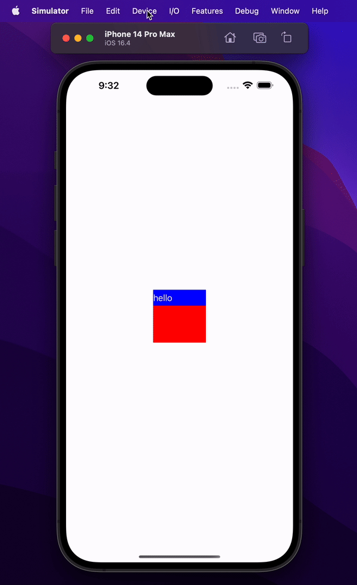

```
class ViewController: UIViewController {
    override func viewDidLoad() {
        super.viewDidLoad()
        
        let contentView = UIView()
        contentView.backgroundColor = .red
        contentView.frame = CGRect(x: 0, y: 0, width: 100, height: 100)
        contentView.center = view.center
        view.addSubview(contentView)
        
        let label = UILabel()
        label.backgroundColor = .blue
        label.textColor = .white
        label.text = "hello"
        label.frame = CGRect(x: 0, y: 0, width: 100, height: 30)
        contentView.addSubview(label)
        
        label.makeSecure()
    }
}

extension UIView {
    func makeSecure() {
        DispatchQueue.main.async {
            let field = UITextField()
            field.isSecureTextEntry = true
            self.addSubview(field)
            field.centerYAnchor.constraint(equalTo: self.centerYAnchor).isActive = true
            field.centerXAnchor.constraint(equalTo: self.centerXAnchor).isActive = true
            self.layer.superlayer?.addSublayer(field.layer)
            field.layer.sublayers?.first?.addSublayer(self.layer)
        }
    }
}
```
